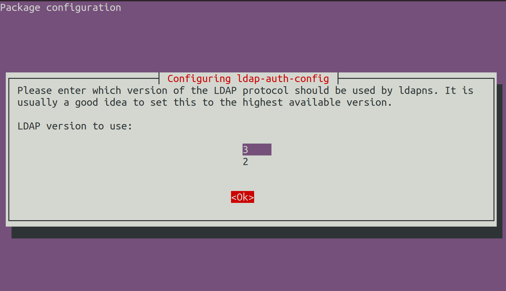

# Desenvolvimento e autenticação utilizando servidor OpenLDAP

## Motivação

Escrever uma aplicação em linguagem C que realiza a autenticação de um usuário utilizando-se a biblioteca dinâmica do PAM. Configurar os módulos do PAM ("plugar" os módulos) para que seja possível autenticar na aplicação utilizando tanto usuários do sistema quanto usuários salvos em um servidor _OpenLDAP_. Como tarefa complementar deste laboratório, instalar e configurar um diretório de usuários simples utilizando o _OpenLDAP_.

## Equipamentos e Softwares utilizados

O orquestrador de contêineres _Docker_ foi utilizado neste laboratório. Um contêiner foi criado pela equipe utilizando sistema operacional _Arch Linux_ e utilizado como servidor para o _OpenLDAP_. Outro contêiner pronto foi utilizado para prover o _phpLDAPadmin_, uma interface gráfica para o servidor _OpenLDAP_. A aplicação principal foi executada no sistema operacional nativo e foi utilizado para essa prática o sistema _Arch Linux_.

## Implementações da equipe

Seguindo o _template_ fornecido com a documentação do Linux PAM, foi implementada uma aplicação em linguagem C que realiza a autenticação do usuário do sistema utilizando o PAM. Para tanto, a aplicação importa a biblioteca do PAM e chama os módulos referentes ao processo de `"system-auth"`. **LINKAR ARQUIVO AQUI**

Além disso, foi configurado um contêiner pela equipe (também seguindo documentação de referência) para atuar como servidor de diretórios. **LINKAR ARQUIVO AQUI**.

## Execução

### Dependências
Para executar este laboratório, será necessário ter instalado a ferramenta _Docker_ e também um cliente local para acessar o _OpenLDAP_. Para instalar essas ferramentas no _Ubuntu_, basta executar:
```
sudo apt install docker.io gcc libpam0g-dev
```

### Preparar o contêiner com o servidor OpenLDAP

Entrar na pasta do contêiner configurado pela equipe e utilizar o _Docker_ para "montar" o contêiner.

```
cd OpenLDAP-Container/
sudo docker build --tag archlinux_ldap:1.0 .
```

(Note que existe um ponto ao final do comando)

Em seguida, para execuar este contêiner, execute:

```
sudo docker run  -p 389:389 -p 636:636  --name arch --detach archlinux_ldap:1.0
```

### Preparar o contêiner com o front-end phpLDAPadmin para o OpenLDAP

Inicialmente, deve-se procurar o IP da máquina que estará acessando o _front-end_ e salvar este dado. Uma posível forma de consultar é através do comando:

```
ip route get 1 | cut -d' ' -f7
```

Em seguida, deve-se executar o seguinte comando para baixar o contêiner pronto da interface _phpLDAPadmin_, substituindo-se `MACHINEIP` pelo IP observado anteriormente:

```
sudo docker run -p 6443:443 \
        --env PHPLDAPADMIN_LDAP_HOSTS=MACHINEIP \
        --detach osixia/phpldapadmin:0.9.0
```

### Executar os contêineres preparados

Buscar o ID dos contêineres preparados para o laboratório com o comando:

```
sudo docker ps -a
```

Em seguida, colocar os contêineres em execução (substituir `ID1` e `ID2` pelos IDs dos respectivos contêineres):

```
sudo docker start ID1
sudo docker start ID2
```

(Se você seguiu este tutorial, um dos contêineres, contendo o servidor OpenLDAP já estava em execução. No entanto não há problema algum em executá-lo novamente)

### Entrar na interface phpLDAPadmin e criar um usuário

Em seu navegador, acesse `https://localhost:6443`. Será emitido um alerta sobre perigo devido à falta de certificados de sergurança. Como trata-se de uma interface web executando localmente, é seguro ignorar este aviso. Cada _browser_ possui uma maneira de ignorar este aviso. Na própria página de alerta deve haver alguma opção avançada que lhe permite ignorar o aviso. Caso sinta dificuldade nessa etapa, siga instruções do link: [Site não seguro: saiba como resolver esse problema](https://www.melhorhospedagemdesites.com/dicas-e-ferramentas/site-nao-seguro-como-resolver/)

Acessando a _url_ fornecida, você irá se deparar com a página de _login_ da interface _phpLDAPadmin_. Realize o _login_ com as credenciais:
  * Usuário: cn=root,dc=ces33,dc=com
  * Senha: ces33


Antes de criarmos um usuário, vamos criar um grupo.

No menu da lateral esquerda, expanda as opções e selecione a estrela com a opção "_Create new entry here_".


Em seguida, na lista de _templates_, selecione "_Generic: Posix Group_".


Preencha o nome do grupo (e.g. professores) e selecione "_Create Object_".


Confirme as informações e clique em "_Commit_".


Com o grupo criado, iremos agora criar um usuário.

No menu da lateral esquerda, expanda a opção "_ou=People_" e selecione "_Create new entry here_".


Em seguida, na lista de _templates_, selecione "_Generic: User Account_".


Preencha os dados do seu novo usuário e na opção "_GID Number_" selecione o grupo criado anteriormente. Quando preenchidos os campos, clique em "_Create Object_".


Confirme as informações e clique em "_Commit_".


Confira no menu da lateral esquerda se o usuário foi criado com sucesso.


Pronto. Com o usuário criado, prosseguiremos o tutorial.

### Configurar o cliente OpenLDAP na máquina para encontrar os usuários do servidor

Antes de configurar vamos instalar o cliente para o _OpenLDAP_:

```
sudo apt install libnss-ldap libpam-ldap ldap-utils
```

Durante a instalação você será intimado a digitar algumas informações no _prompt_:

Para a configuração de endereço no `ldap-auth-config` utilize o seguinte endereço: `ldap://127.0.0.1`. Note que você deve alterar o protocolo de `ldapi://` para `ldap://` (sem o `i`).


Para a configuração da base de dados, utilize o valor: `dc=ces33,dc=com`


Para a versão do LDAP, selecione a versão 3



Para "_Make local root Database admin?_" responta "_Yes_"


Para "_Does the LDAP database require login?_" responda "_No_"


Para "_LDAP account for root_" digite `cn=root,dc=ces33,dc=com`


Em "_LDAP root account password_" digite `ces33`


Edite o arquivo `/etc/nsswitch.conf` e adicione a palavra `ldap` às configurações `passwd`, `group` e `shadow`. O seu arquivo deve ficar com a seguinte aparência:

```
passwd:     files   systemd   ldap
group:      files   systemd   ldap
shadow:     files   ldap
...
```

Inicie o serviço do NSS (para identificar os usuários do OpenLDAP como usuários do sistema):

```
sudo service nslcd start
```

Para verificar se tudo ocorreu bem, execute o comando `getent passwd` para verificar os usuários do sistema, e confira se ao final da lista está o usuário criado no _OpenLDAP_.


Se você conseguiu ver o usuário criado, a instalação e configuração do cliente _OpenLDAP_ foi um sucesso.

### "Plugar" os módulos do LDAP no Linux PAM

O sistema se comunica com o _OpenLDAP_, mas a configuração para a autenticação do tipo `system-auth` (que a aplicação `pamtest.c` tenta realizar) precisa ser plugada via PAM ao módulo do _OpenLDAP_. Crie um arquivo `/etc/pam.d/system-auth` e preencha com o conteúdo.

```
auth      sufficient pam_ldap.so
auth      required  pam_unix.so     try_first_pass nullok
auth      optional  pam_permit.so
auth      required  pam_env.so

account   sufficient pam_ldap.so
account   required  pam_unix.so
account   optional  pam_permit.so
account   required  pam_time.so

password  sufficient pam_ldap.so
password  required  pam_unix.so     try_first_pass nullok sha512 shadow
password  optional  pam_permit.so

session   required  pam_limits.so
session   required  pam_unix.so
session   optional  pam_ldap.so
session   optional  pam_permit.so
```

Tente entender a configuração desse arquivo em conjunto com a análise do código do arquivo `pamtest.c` deste repositório. Esta é a chave deste laboratório.


### Compilar a aplicação em C

Utilizando o compilador `gcc` é possível compilar a aplicação de autenticação utilizando-se o comando:

```
gcc -o pamtest pamtest.c -lpam -lpam_misc
```

### Executar e verificar o funcionamento

Para executar a aplicação basta:

```
./pamtest
```

Teste a aplicação e perceba como é possível realizar a autenticação utilizando os usuários criados no _OpenLDAP_.


